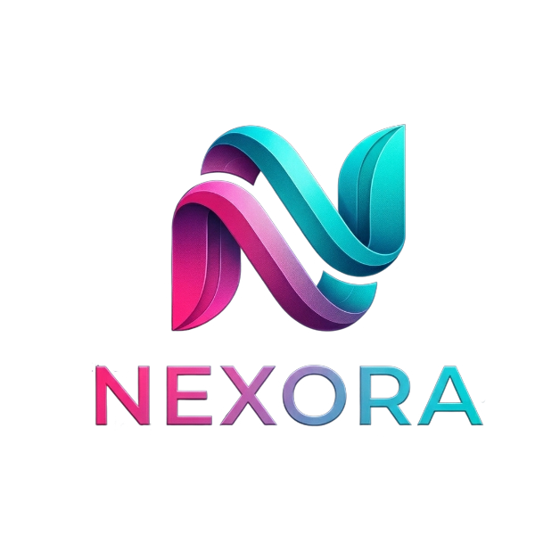

<div align="center">
  
<p align="center">


</p>
 
 
</div>


 

---
# 📋 About the project
 
**Nexora** is an educational game that helps students **test their knowledge** in a fun and interactive way. Players create an account and solve different questions to challenge what they know and improve their skills.

The game also includes a **multiplayer mode**, where one player creates the questions and the other competes to answer them, making the experience more dynamic and competitive. Each player has a personal space to track scores, progress, and achievements. **Nexora** makes learning more exciting and enjoyable. 


# ⚙️ Installation and Setup
 
1. 📥 Clone the project using the "Code" button or run:
 
   ```bash
 
   https://github.com/IHNoneva24/Nexora.git
<br>
 
2. 📂 Open Nexora game. <br><br>
 
3. ▶️ Start the game.
# 🕹 How to play
 
1.  Create your account in the game.
 
2.  Choose whether to play alone or with a friend.
 
3.  Get to know the rules.
 
4.  Play and have fun while gaining knowledge!

# 🛠️💻 Tech Stack
## 🎨 Design :
<br>
<div align="left">

</div>

## 💬 Languages :
<br>
<div align="left">

</div>
 
## 📞 Comunication :
<div align="left">

</div>

## 🛠️ Tools :
<div align="left">


</div>
 
 
## 📄 Programs for documents
<div align="left">


</div>

# 📁 Documents
+ [Presentation](https://codingburgas-my.sharepoint.com/:p:/g/personal/ihnoneva24_codingburgas_bg/IQDxNegdaOTrRJjqdbxE-O2gAVyDnqdeVmyVrgj4gRoA6W4?e=t6EwFO)
+ [Documentation](https://codingburgas-my.sharepoint.com/:w:/g/personal/ihnoneva24_codingburgas_bg/IQDJPAx-fO_9QI2Yd9Wczu5qAYnXnBoh71_mhq0wrHpX36A?e=u73isD)
 
 

# 👥 Team Members
 
| Name | Role | Grade |
|------|-------|--------|
| [**Maria Pavlova**](https://github.com/MKPavlova24) | Front-End Developer | 🟡 9A |
| [**Iveta Noneva**](https://github.com/IHNoneva24) | Scrum Trainer | 🔴 9B |
| [**Galin Enev**](https://github.com/GKEnev24) | Back-End Developer | 🔴 9B |
| [**Velin Markov**](https://github.com/VVMarkov24) | Front-End Developer | 🔵 9G |
<h2 align="center">
 
If you like the app, you can give a 🌟 to our repository!
</h2>
